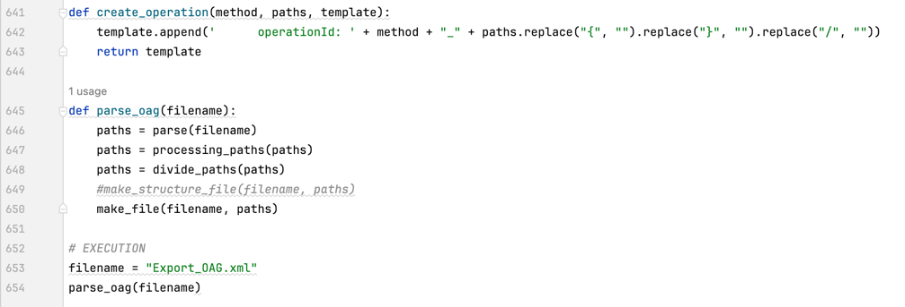

# Migrate APIs from Oracle API Gateway (OAG) to OCI API Gateway

## Introduction

Oracle API Gateway is a widespread on-premises platform used by companies that in the past wanted to expose their legacy systems through APIs for integration with Web, Mobile or even client-server applications. This is a long time ago.

In this article, I would like to explain a way to migrate the APIs implemented in Oracle API Gateway to a more modern, scalable technology, within Cloud Native standards and that can be used in hybrid environments (cloud or on-premises). The proposal is to accelerate this migration to the OCI API Gateway.

The Oracle Cloud Infrastructure API Gateway (OCI API Gateway) service allows you to publish APIs with accessible private endpoints on your network and that you can expose with public IP addresses if you want them to accept internet traffic. Endpoints support API validation, request and response transformation, CORS, authentication and authorization, and request limitation.

Using the OCI API Gateway Service, you create one or more API Gateways on a regional subnet to process API client traffic and route it to back-end services. You can use a single API Gateway to link multiple backend services (such as load balancers, compute instances, and Oracle Cloud Infrastructure Functions) into a single consolidated API endpoint.

You can access the OCI API Gateway Service to define API Gateways and API deployments using the OCI Console and the REST API.

The OCI API Gateway service is integrated with Oracle Cloud Infrastructure Identity and Access Management (OCI IAM), which provides easy authentication with native Oracle Cloud Infrastructure (OCI) identity functionality.

This material allows you to prepare artifacts for migration to the OCI API Gateway and should be used in conjunction with this other article I wrote:

[Implement an Automation to Deploy an OpenAPI spec into OCI API Gateway](https://github.com/hoshikawa2/OCI_API_Gateway_Automation2/blob/main/README.md)

### Will Do and Will not Do

This artifacts will do:

- Create a Swagger specification from the Oracle API Gateway (OAG) XML exported file automatically
- Allow OCI API Gateway to import automatically from the Swagger Specification generated
- See what processes and orquestration need to be implemented on Oracle Integration and be integrated with OCI API Gateway

This artifacts will not do:

- The complete migration from Oracle API Gateway to OCI API Gateway AS-IS. You will need to implement some integrations to orquestrate steps. Sometimes, analyze the context of your APIs will take your application to a modern approach and to a more Cloud Native environment.

### Strategy to migrate from Oracle API Gateway to the OCI API Gateway

This strategy does not allow AS-IS migration directly to the OCI API Gateway as they are slightly different technologies.
While the OAG has mechanisms to create mappings between paths and their policies, generating complex treatment rules for authorization/authentication, HEADERs, call orchestrations with business rules and other complexities of an API; The OCI API Gateway works only as an API gateway, allowing some processing of HEADERs, establishing some timeout and throttling principles, but without major complexities. The tool aims to be simpler and delimits its functionalities precisely because it is part of a range of services that complement the other functionalities that were left out.

The objective here is to divide the routing of APIs for the OCI API Gateway and the complexities and orchestration rules for Oracle Integration.

### Steps to migrate the APIs

These are the steps for migration:

- Export the APIs in Oracle API Gateway: OAG can export all definitions in a XML file. We will use this artifact to accelerate the process of migration
- Convert the Oracle API Gateway XML to a Swagger Specification: We use the OAG XML file to convert it into a YAML Swagger file
- Deploy the Swagger to OCI API Gateway: With the Swagger file, we can import into OCI API Gateway through an automation process
- Implement the Orquestration in Oracle Integration: Here, we need to analyze case by case and implement the orquestration, business rules and validations

### Export the Oracle API Gateway APIs

This is the link to know how to export APIs definitions in the OAG: [Exporting API Gateway configuration](https://docs.oracle.com/cd/E39820_01/doc.11121/gateway_docs/content/general_export.html)
You will get a XML file that will contain all the APIs definitions.

### Convert the Oracle API Gateway XML to a Swagger Specification 

Change the variable filename to your exported OAG XML file and execute the Python [generate_swagger.py](./source/generate_swagger.py) file.

You will receive files with YAML extension. Each file is a Swagger definition for a API defined in the OAG.

You will get inside the Swagger definition some lines commented. This lines represent the OAG orquestration on each API. This will help to plan and construct the orquestration in OIC.

Change the [map_details.py](./source/map_details.py) Python file to include your OAG XML definition file and a filename for you output mapping definitions.

After run this python code, you will get a more detailed definitions for each orquestration steps mentioned previously in the Swagger.

### Deploy the Swagger to OCI API Gateway

All the YAML files generated by the Python code can be deployed in the OCI API Gateway with this project:

[Implement an Automation to Deploy an OpenAPI spec into OCI API Gateway](https://github.com/hoshikawa2/OCI_API_Gateway_Automation2/blob/main/README.md)

This project will import the Swagger specification generated here and will deploy the APIs to use.
You will need to adjust the backends manually as part of this documentation. See the next step to know more.

### Implement the Orquestration in Oracle Integration

First of all, we must analyze each step of the APIs in OAG.
Some steps are business rules and orchestrations and these should be part of an implementation in Oracle Integration. This implementation can be exposed in the OCI API Gateway, thus following the same processes executed in OAG.
However, there are several steps that would not need to be implemented within Oracle Integration, some of them:

- Authentication and authorization
- Treatment of HEADERs, QUERY parameters and BODY
- Routing paths

Authentication and authorization processes can and should be implemented in the OCI API Gateway layer. There are several ways to implement this, through JWT, OAuth2, among others; in addition to allowing customization. See this article to implement your authentication and authorization mechanisms: [Passing Tokens to Authorizer Functions to Add Authentication and Authorization to API Deployments](https://docs.oracle.com/en-us/iaas/Content/APIGateway/Tasks/apigatewayusingauthorizerfunction.htm)

HEADER (as well as QUERY parameters and BODY) processing can be done in the OCI API Gateway itself. Processing can be done in both REQUEST and RESPONSE.

Logs can also be handled in the OCI API Gateway, but it is always good to have the entire circuit logged, that is, if there are implementations in Oracle Integration, try to implement the logs there as well.

## Reference

- [Implement an Automation to Deploy an OpenAPI spec into OCI API Gateway](https://github.com/hoshikawa2/OCI_API_Gateway_Automation2/blob/main/README.md)

- [Install the OCI CLI](https://docs.oracle.com/en-us/iaas/Content/API/SDKDocs/cliinstall.htm)
- [Creating Your First API Gateway In The Oracle Cloud](https://blogs.oracle.com/developers/post/creating-your-first-api-gateway-in-the-oracle-cloud)
- [Functions QuickStart Guides](https://docs.oracle.com/en-us/iaas/Content/Functions/Tasks/functionsquickstartguidestop.htm)
- [Oracle Functions Samples](https://github.com/oracle-samples/oracle-functions-samples)
- [Passing Tokens to Authorizer Functions to Add Authentication and Authorization to API Deployments](https://docs.oracle.com/en-us/iaas/Content/APIGateway/Tasks/apigatewayusingauthorizerfunction.htm)
- [Create a JWT Token in Java for Oracle Identity Cloud Service](https://www.ateam-oracle.com/post/create-a-jwt-token-in-java-for-oracle-idcs)
- [Protect APIs with API Gateway using Oracle Identity Cloud Service/IAM JWT with Scopes and Claims](https://blogs.oracle.com/coretec/post/protect-apis-with-api-gateway-using-idcsiam-jwt-with-scopes-and-claims)
- [Exporting API Gateway configuration](https://docs.oracle.com/cd/E39820_01/doc.11121/gateway_docs/content/general_export.html)

## Acknowledgments

- **Author** - Cristiano Hoshikawa (Oracle LAD A-Team Solution Engineer)
